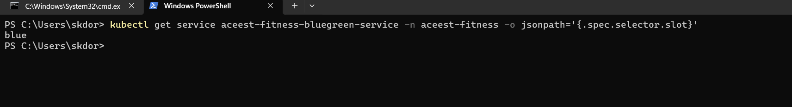
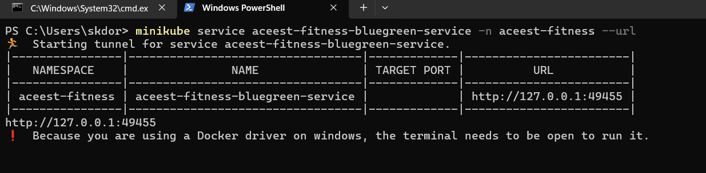

# ACEest Fitness & Gym Management System
## 🏗️ Architecture

```
┌─────────────────────────────────────────────────────────────┐
│                     User Interface                          │
│              (Flask Web Application)                        │
└────────────────────┬────────────────────────────────────────┘
                     │
┌────────────────────▼────────────────────────────────────────┐
│                   CI/CD Pipeline                            │
│  ┌──────────┐  ┌──────────┐  ┌──────────┐  ┌──────────┐  │
│  │  GitHub  │─▶│ Jenkins  │─▶│  Docker  │─▶│   K8s    │  │
│  └──────────┘  └──────────┘  └──────────┘  └──────────┘  │
└─────────────────────────────────────────────────────────────┘
                     │
         ┌───────────┴───────────┐
         │                       │
┌────────▼──────┐       ┌────────▼──────┐
│   SonarQube   │       │    Docker     │
│ Code Quality  │       │     Hub       │
└───────────────┘       └───────────────┘
                               │
                     ┌─────────▼──────────┐
                     │  Kubernetes Cluster │
                     │  ┌──────────────┐  │
                     │  │  Deployments │  │
                     │  │   Services   │  │
                     │  │     Pods     │  │
                     │  │     HPA      │  │
                     │  └──────────────┘  │
                     └────────────────────┘
```

DOCKER IMAGES:


MINIKUBE RUNNING SERVICE:


APplication Running Screen shot:


MINIKUBE SCREEN SHOT FOR RUNNING PODS:


SHOWING KUBERNETES DASHBOARD:


POD:


SERVICES:


CONFIG MAPS:


Rolling out Deployment:


SCALING PODS:


BLUE GREEN DEPLOYMENT:




MINKUBE GET URLS FOR BLUE GREEN:




