# ACEest Fitness & Gym Management System
## 🏗️ Architecture

```
┌─────────────────────────────────────────────────────────────┐
│                     User Interface                          │
│              (Flask Web Application)                        │
└────────────────────┬────────────────────────────────────────┘
                     │
┌────────────────────▼────────────────────────────────────────┐
│                   CI/CD Pipeline                            │
│  ┌──────────┐  ┌──────────┐  ┌──────────┐  ┌──────────┐  │
│  │  GitHub  │─▶│ Jenkins  │─▶│  Docker  │─▶│   K8s    │  │
│  └──────────┘  └──────────┘  └──────────┘  └──────────┘  │
└─────────────────────────────────────────────────────────────┘
                     │
         ┌───────────┴───────────┐
         │                       │
┌────────▼──────┐       ┌────────▼──────┐
│   SonarQube   │       │    Docker     │
│ Code Quality  │       │     Hub       │
└───────────────┘       └───────────────┘
                               │
                     ┌─────────▼──────────┐
                     │  Kubernetes Cluster │
                     │  ┌──────────────┐  │
                     │  │  Deployments │  │
                     │  │   Services   │  │
                     │  │     Pods     │  │
                     │  │     HPA      │  │
                     │  └──────────────┘  │
                     └────────────────────┘
```
## SONAR SCAN REPORT(Running locally):

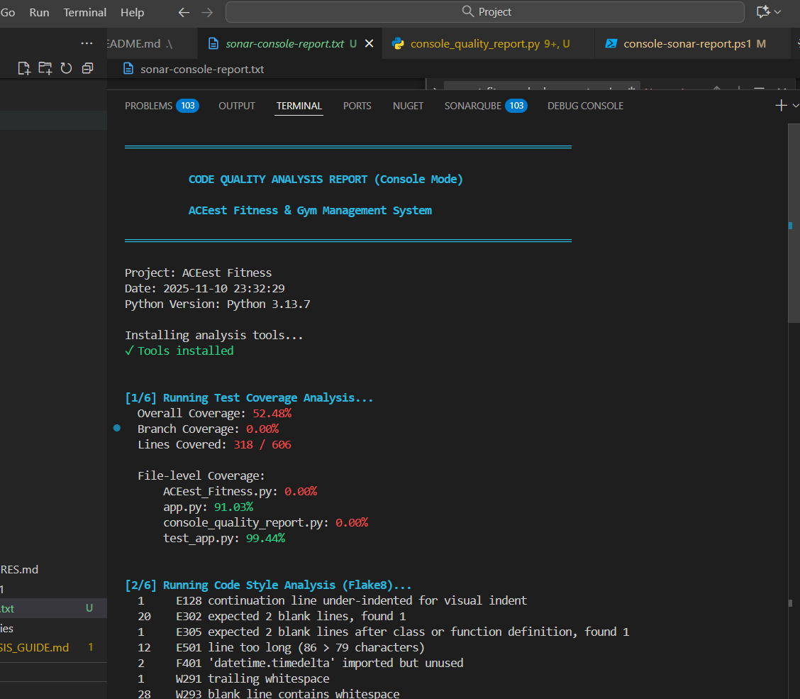

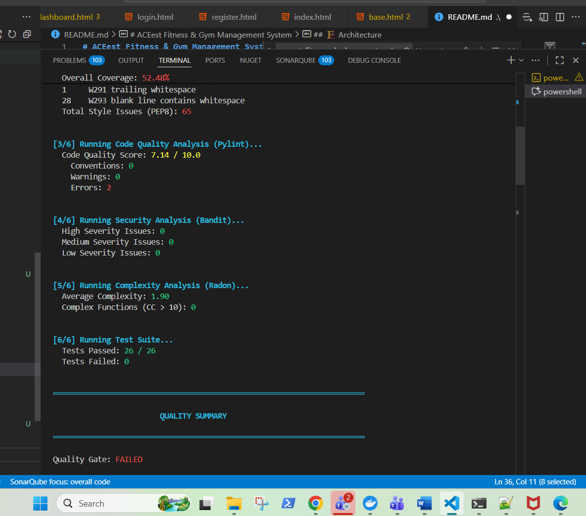

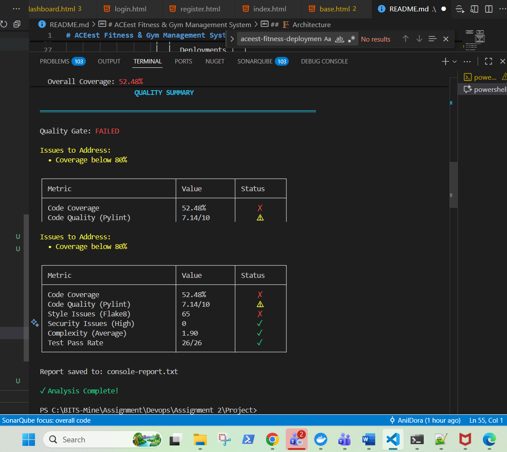

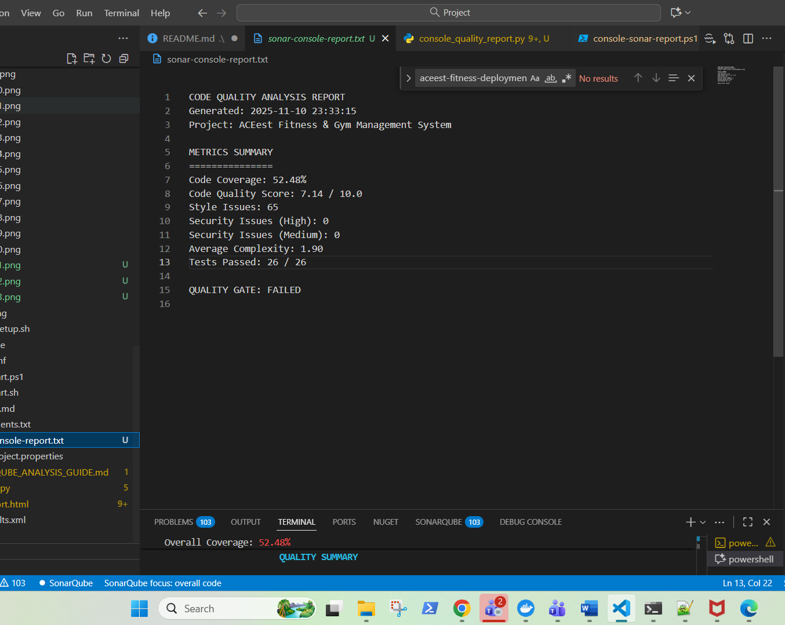

## UNIT TEST CASE REPORT:

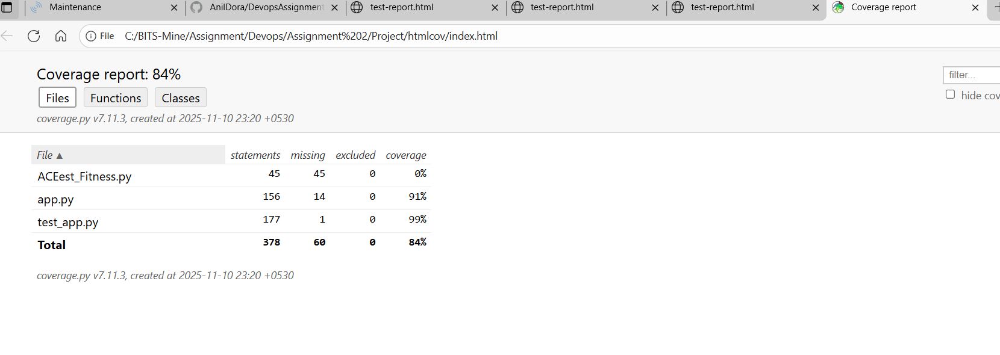

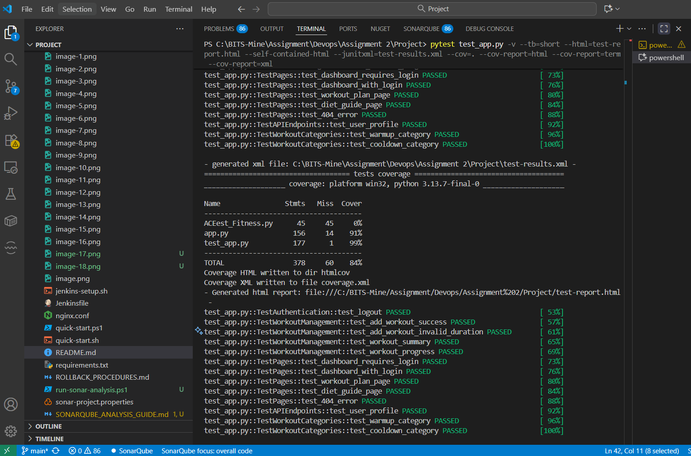

## DOCKER IMAGES:
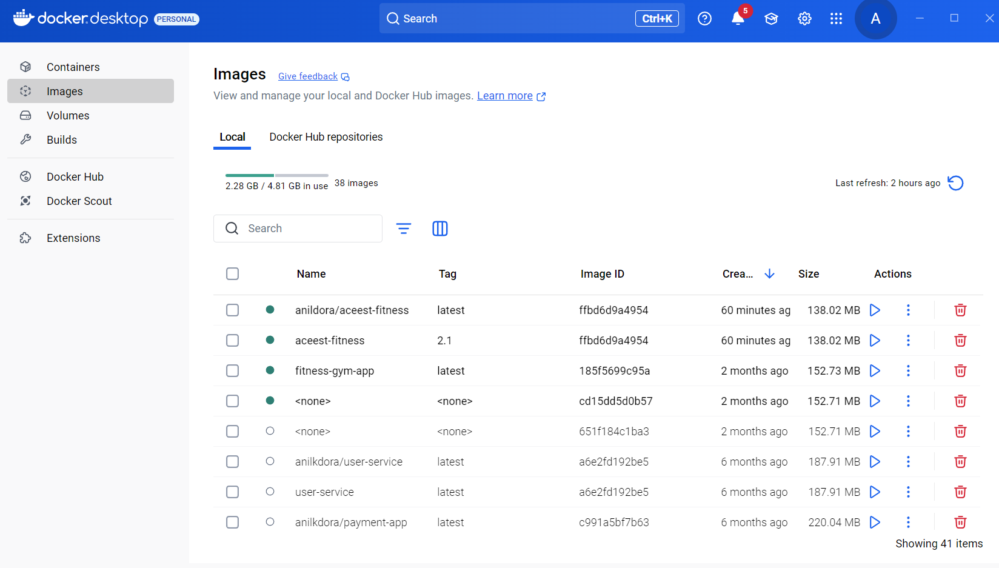


## MINIKUBE RUNNING SERVICE:

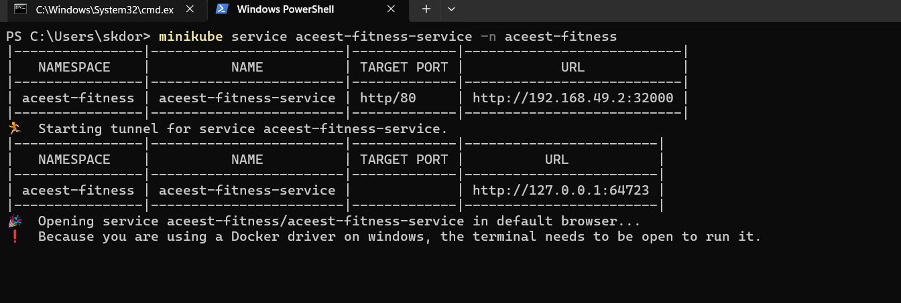


## Application Running Screen shot:

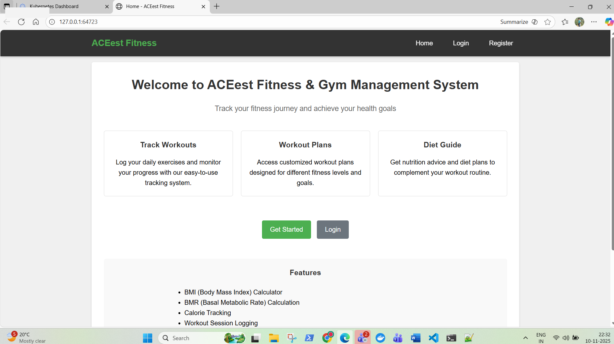


## MINIKUBE SCREEN SHOT FOR RUNNING PODS:

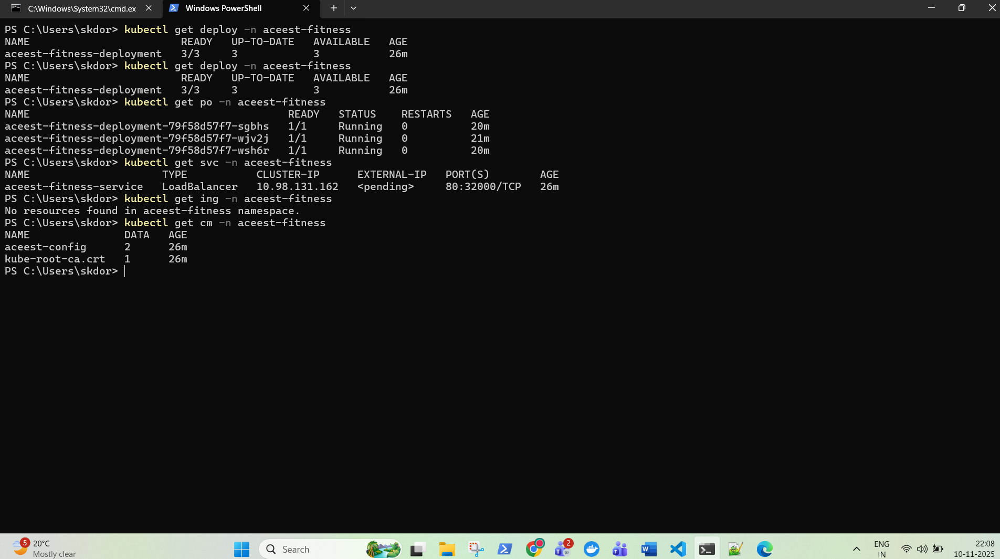

## SHOWING KUBERNETES DASHBOARD:


## POD:

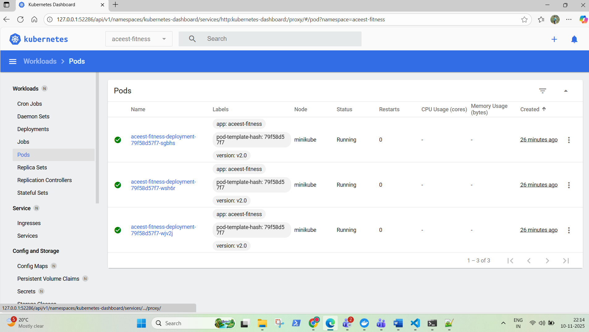

## SERVICES:


## CONFIG MAPS:


## Rolling out Deployment:

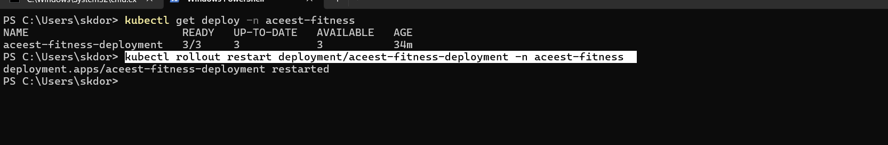

## SCALING PODS:

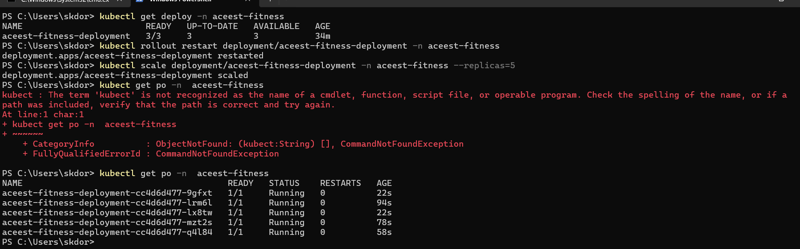


## BLUE GREEN DEPLOYMENT:


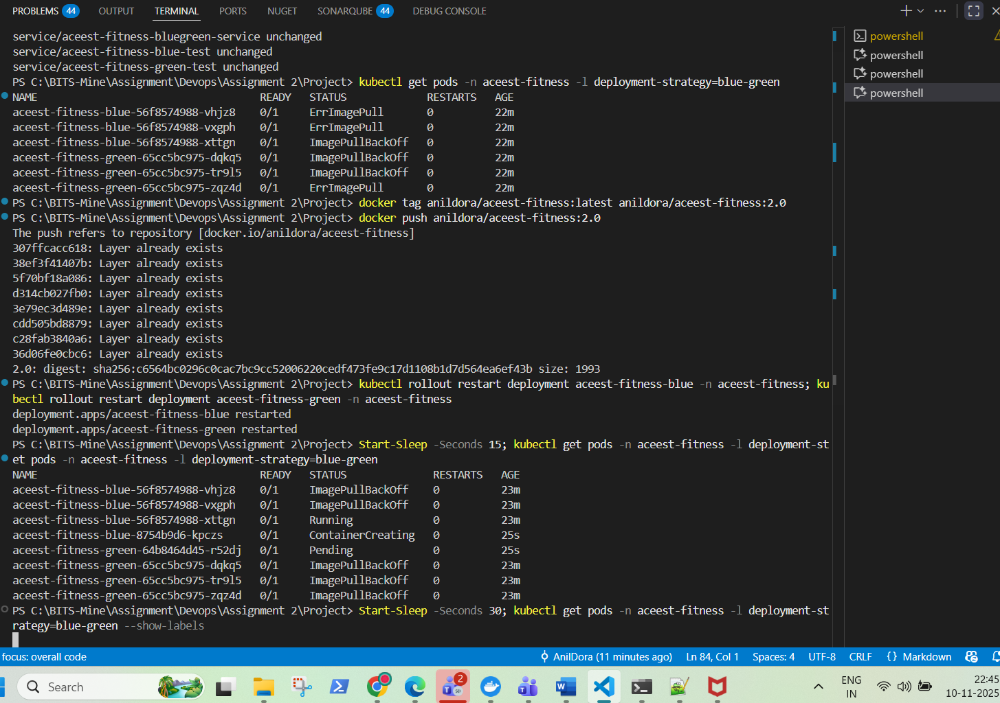

## CANARY DEPLOYMENT:

kubectl apply -f "C:\BITS-Mine\Assignment\Devops\Assignment 2\Project\k8s\canary-deployment.yaml"
kubectl rollout status deployment/aceest-fitness-stable -n aceest-fitness
kubectl rollout status deployment/aceest-fitness-canary -n aceest-fitness

# Increase canary traffic (20%)
kubectl scale deployment aceest-fitness-stable -n aceest-fitness --replicas=8
kubectl scale deployment aceest-fitness-canary -n aceest-fitness --replicas=2

# 50/50 split
kubectl scale deployment aceest-fitness-stable -n aceest-fitness --replicas=5
kubectl scale deployment aceest-fitness-canary -n aceest-fitness --replicas=5

# Complete rollout to canary
kubectl scale deployment aceest-fitness-stable -n aceest-fitness --replicas=0
kubectl scale deployment aceest-fitness-canary -n aceest-fitness --replicas=10

# Rollback (remove canary)
kubectl scale deployment aceest-fitness-canary -n aceest-fitness --replicas=0
kubectl scale deployment aceest-fitness-stable -n aceest-fitness --replicas=10

## Shadow Deployment:

kubectl apply -f "C:\BITS-Mine\Assignment\Devops\Assignment 2\Project\k8s\shadow-deployment.yaml"
kubectl rollout status deployment/aceest-fitness-production -n aceest-fitness
kubectl rollout status deployment/aceest-fitness-shadow -n aceest-fitness


